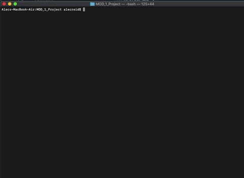
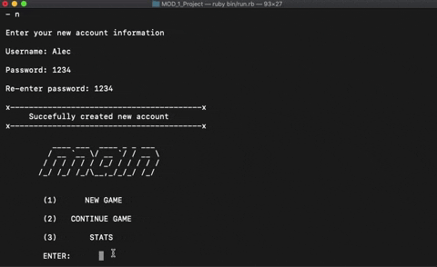
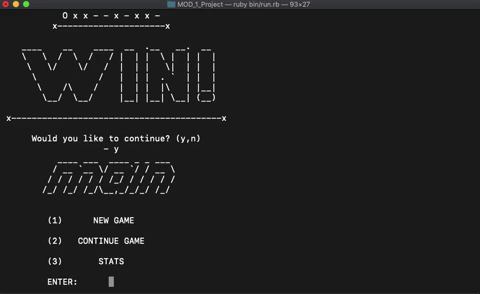
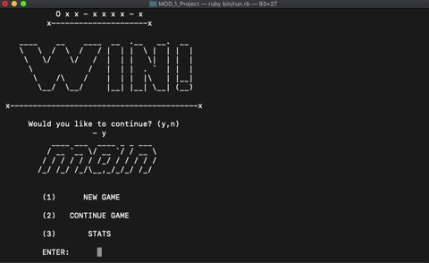

# Extreme Connect 4
Extreme Connect 4 is simply Connect 4 on steroids. Be warned, this version is not for the faint of heart. 

## Prerequesites
Before you attempt to run this application, please be sure to run the following: bundle install

After completing 'bundle install', type the following in the command line: rake db:migrate

### Running the Application
To begin the application, type the following in your terminal command line: ruby bin/run.rb

If you have an existing account, type "y" and enter your username and password, otherwise type "n" and create a new account like so:

After logging in or creating a new account, the main menu will show the following options:

*Type "1" to begin a new game

*Use keys 0-9 to drop a piece to the corresponding column

*Type "2" to resume progress on a previous game

*Type "3" to view the statistics menu where you can view either your personal stats or global stats

#### Authors

*[Vincent Marks](https://www.github.com/vimarks)

*[Alec Reid](https://www.github.com/areid0093)

*[Wookeun Oscar Song](https://www.github.com/bigg-o)
